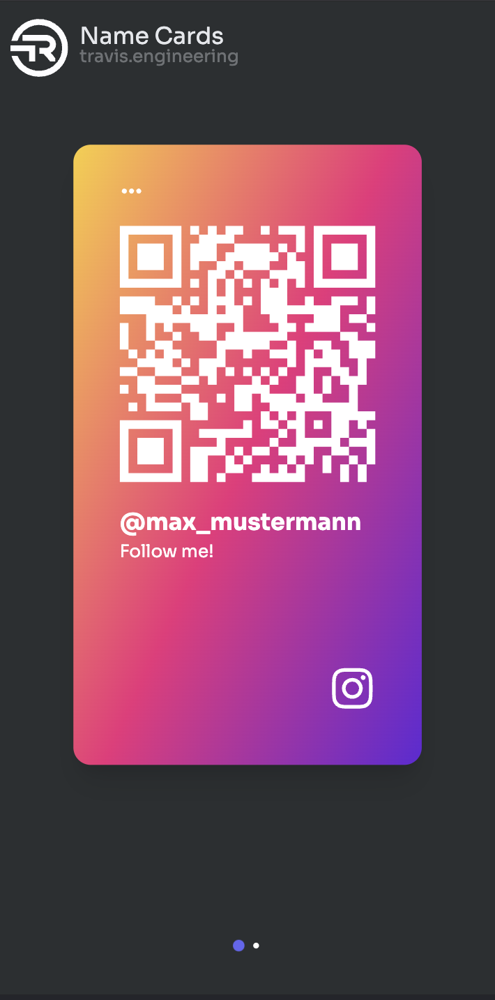

# TOP Name Card

> Share your contact with style.



The **TOP Name Card** (part of Travis' Over-engineered Projects) aims to solve 2 problems in a similar fashion:

- Many times I would like to share my contact in social events, however I would like to help filling in the contact info based on the nature of the contacts (business, casual, friends etc.) and I would like to save them the hustle of typing lots of info and making mistakes.
- I would like to make a communication with someone far or close but behind a window (I know it sounded awkward, but believe me that happened to me before.) and I would like a set of fixed phrases to be displayed on my phone with a font as large as possible.

This app solves these two problem by displaying QR Code, natural texts, or combination of both, according to the `Name cards` you defined in advance.

## How it works

Before you are caught in situations where you need to share your contact / make a visual communication, create the `name cards` that are saved locally on the device by pressing the `+` button on the upper right corner.

There are different categories of `name cards` available and each differs by colors and display nature:

- `Instagram` name cards show a QR code with a format `https://instagram.com/<the_handle_you_entered>`. Scanning it should bring your phone to the profile with the handle you provided in the name card.
- `Whatsapp` name cards show a QR code with an URL `https://api.whatsapp.com/send?phone=<the_phone_number_you_entered>`. A phone that scans this code should open a chat between that person and the phone number written on the name card on WhatsApp.
- `Facebook` name cards show a QR code with an URL `https://www.facebook.com/<facebook_id_you_entered>`. Scanning it should open the desired facebook profile.
- `Business` name cards show a QR code that contains a [vCard](https://en.m.wikipedia.org/wiki/VCard). When a smartphone (I mean iPhone or Android, although I only tested this feature on iPhone) scans that QR code, it prefills the contact with corresponding info (For now I only chose to support first name, last name, email, url and phone number) and one can click "Add to new contact" to quickly save the contact info you provided.
- _(new!)_ `LinkedIn` name cards allow you to enter your username on Linkedin and shows `https://www.linkedin.com/in/${username}` on the QR Code.
- _(new!)_ `X` name cards will show `https://x.com/<username>`
- `Other` name cards allow you to enter arbitrary text and contents for the QR code.

## But why?

I know Whatsapp and instagram already provides QR code to share your own profiles / number and the time you spend typing out your number / other contact info is probably much shorter than me developing this. But that is the reason I put it under `Travis' Over-engineered Projects`, plus it is never meant to solve an unsolved problem. Rather I use this as an opportunity to have a hands-on experience with [Vite](https://vitejs.dev), particularly the possibility to create a Progressive Web App (PWA) with offline functionality with it (with the help of [Vite PWA Plugin](https://vite-pwa-org.netlify.app)). I would also like to share my own contact in my own style (at least for me, just clicking a tons of button to get a built-in QR code on instagram to share is a bit too conventional). After all, I like to build applications. So I spent some of my vacation time to build this.

## Where can I use this?

I host the app with GitHub pages. You can use it on [https://travistang.github.io/top-name-card/](https://travistang.github.io/top-name-card/)

## Roadmap

- [ ] Arbitrary font colors and background colors.
- [x] Remove redundant name card types (phone number)
- [x] Display list of name cards in a fancier way (like how the cards are shown in Apple Wallet)

## Development

To run the code in development, simply do the following:

```
git clone https://github.com/travistang/top-name-card
cd top-name-card
npm install
npm run dev
```

PRs, issues and comments are always welcome 😄
